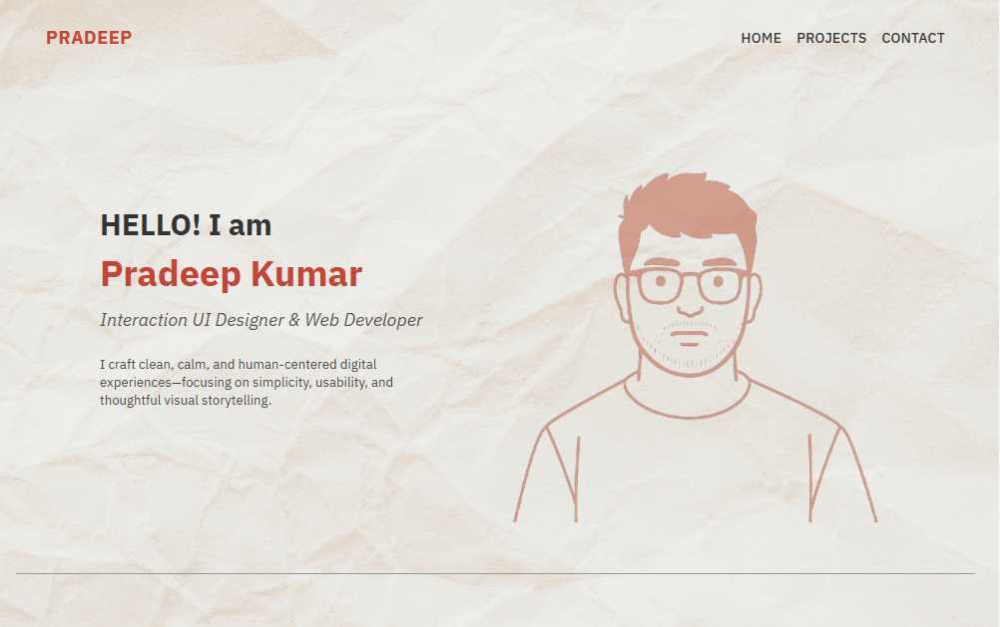

# 🌐 Personal Portfolio Website

A clean, minimal, and responsive portfolio website built using **React.js**, inspired by Japanese design and focused on showcasing work, projects, and contact information in a visually calm and intentional layout.

---

## 📸 Preview

 

---

## 🚀 Features

- ⚡ **Responsive Design** — Optimized for all screen sizes
- 🎯 **Smooth Navigation** — Scroll to sections from sticky nav links
- 💻 **Project Showcase** — Highlights your best projects with descriptions and GitHub links
- 📬 **Contact Form** — Built-in form to let people reach you via email
- 💾 **Local Fonts** — Uses Google Fonts (DM Serif Display + IBM Plex Sans) for elegant typography

---

## 🛠️ Tech Stack

- **Frontend:** React.js (Vite)
- **Styling:** Custom CSS with rem/em units for responsiveness
- **Email Handling:** EmailJS 

---

